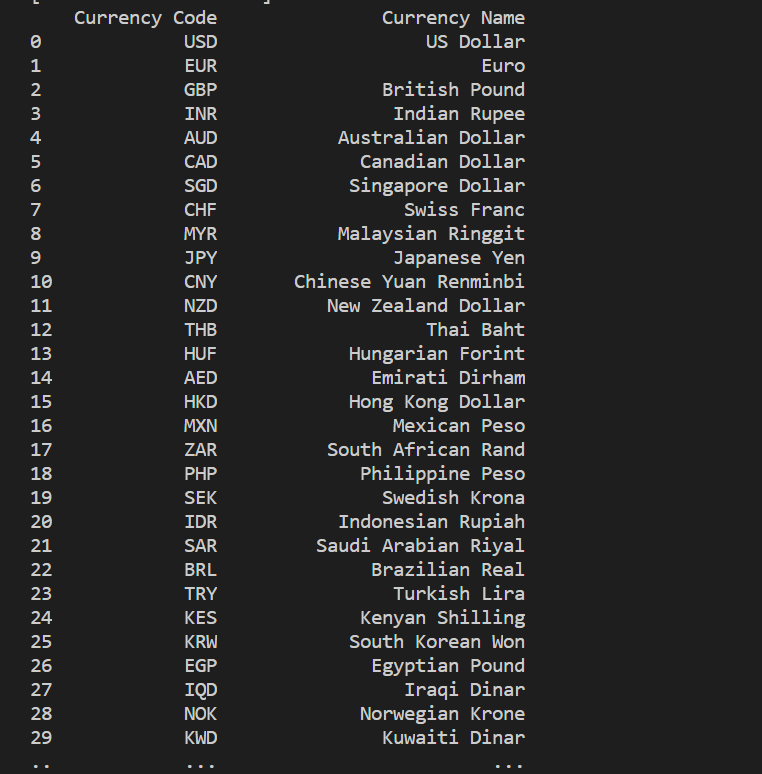

<h1 align="center">
  <br>
  Seleksi 1 Warga Basdat 2019
  <br>
  <br>
</h1>

<h2 align="center">
  <br>
  Data Scraping from xe.com
  <br>
  <br>
</h2>

## Description
Program ini melakukan data scraping terhadap website xe.com. Website ini berisi data currency rate berbagai mata uang di dunia.
Data yang diperoleh dari scraping melalui program ini adalah currency rate berbagai mata uang terhadap mata uang USD (US Dollar) dari tanggal yang ditentukan hingga tanggal yang ditentukan melalui input ke program.


## Specifications

1. Lakukan _data scraping_ dari sebuah laman web untuk memperoleh data atau informasi tertentu __TANPA MENGGUNAKAN API__

2. Daftarkan judul topik yang akan dijadikan bahan _data scraping_ pada spreadsheet berikut: [Topik Data Scraping](https://docs.google.com/spreadsheets/d/1BokKV8Qky7Hmry0dSRsmlT3LKs6jFWEy-BPt32Oc9-o/edit?usp=sharing). Usahakan agar tidak ada peserta dengan topik yang sama. Akses edit ke spreadsheet akan ditutup tanggal __20 Mei 2019 pukul 20.00 WIB__

3. Dalam mengerjakan tugas, calon warga basdat terlebih dahulu melakukan _fork_ project github pada link berikut: https://github.com/wargabasdat/Seleksi-2019-Tugas-1. Sebelum batas waktu pengumpulan berakhir, calon warga basdat harus sudah melakukan _pull request_ dengan nama ```TUGAS_SELEKSI_1_[NIM]```

4. Pada _repository_ tugas 1, calon warga basdat harus mengumpulkan _file script_, json hasil _data scraping_. _repository_ terdiri dari _folder_ `src`, `data` dan `screenshots`. _Folder_ `src` berisi _file script_/kode yang __*WELL DOCUMENTED* dan *CLEAN CODE*__, _folder_ `data` berisi _file_ json hasil _scraper_ sedangkan  _folder_ `screenshot` berisi tangkapan layar program.

5. Peserta juga diminta untuk membuat `_Makefile` sesuai _template_ yang disediakan, sehingga _program_ dengan gampang di-_build_, di-_run_, dan di-_clean_

```Makefile
all: clean build run

clean: # remove data and binary folder

build: # compile to binary (if you use interpreter, then do not implement it)

run: # run your binary

```

6. Deadline pengumpulan tugas 1 adalah __31 Mei 2019 Pukul 23.59__

7. Hasil data scraping ini nantinya akan disimpan dalam DBMS  dan digunakan sebagai bahan tugas analisis dan visualisasi data

8. Sebagai referensi untuk mengenal _data scraping_, asisten menyediakan dokumen "_Short Guidance To Data Scraping_" yang dapat diakses pada link berikut: [Data Scraping Guidance](http://bit.ly/DataScrapingGuidance)

9. Tambahkan juga `.gitignore` pada _file_ atau _folder_ yang tidak perlu di-_upload_, __NB : BINARY TIDAK DIUPLOAD__

10. Mohon memperhatikan __etika__ dalam melakukan _scraping_

11. JSON harus dinormalisasi dan harus di-_preprocessing_
```
Preprocessing contohnya :
- Cleaning
- Parsing
- Transformation
- dan lainnya
```

12. Berikan `README` yang __WELL DOCUMENTED__ dengan cara __override__ _file_ `README.md` ini. `README` harus memuat minimal konten :
```
- Description
- Specification
- How to use
- Ideas and innovations in utilizing the data
- JSON Structure
- Screenshot program (di-upload pada folder screenshots, di-upload file image nya, dan ditampilkan di dalam README)
- Reference (Library used, etc)
- Author
```

## How To Use
1. Jalankan program dengan menggunakan
```
$ python src/main.py
'''
2. Masukan tanggal awal dan akhir data yang diinginkan
3. data akan diupdate ke dalam file json
```

### Ideas and inovation in utilizing the data
Dari data hasil scraping ini dapat digunakan untuk banyak hal.
1. Melakukan pengamatan terhadap ekonomi suatu negara yang dapat dikembangkan ke banyak hal.
  Memprediksi peluang impor dan ekspor yang tepat, investasi ke luar negeri
2. Mengetahui perbandingan kekuatan mata uang suatu negara terhadap USD.
  Melalui data ini juga dapat digunakan untuk melakukan investasi dengan menggunakan valuta asing
dan banyak lagi.


### JSON Structure
Example :
```
  {{"Date":"2019-05-27","Currency Code":"USD","Units per USD":"1.0000000000","USD per Unit":"1.0000000000"}}
```
```
  {{"Currency Code":"KYD","Currency Name":"Caymanian Dollar"}}
```


### Screenshot




### Reference
1. https://realpython.com/python-web-scraping-practical-introduction/
2. https://hackernoon.com/introduction-to-web-scraping-using-python-89b15b57150c

library used :
1. bs4
2. json
3. numpy
4. pandas
5. requests

<p align="center">
  <br>
  Samantha Olivia Tandri - 13517123
  <br>
  <br>
</p>
