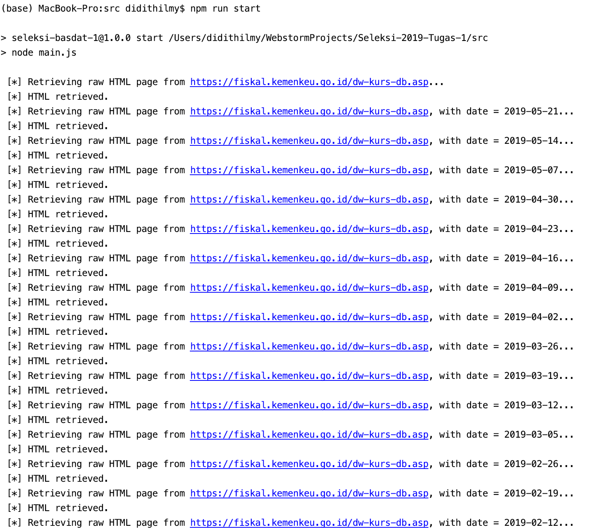

# Histori Kurs Pajak
**Muhammad Aditya Hilmy, NIM 18217025**

## Deskripsi
Kurs Pajak merupakan kurs resmi pemerintah yang digunakan dalam perhitungan pajak yang melibatkan mata uang asing. Adapun Kurs Pajak memiliki nilai yang tetap selama periode waktu tertentu, yang dituangkan dalam Keputusan Menteri Keuangan RI.
 
Script ini melakukan *scraping* pada laman [Kurs Pajak Badan Kebijakan Fiskal, Kementerian Keuangan RI](https://fiskal.kemenkeu.go.id/dw-kurs-db.asp) untuk mendapatkan informasi Kurs Pajak historis. Informasi yang didapatkan adalah:
- Nama mata uang
- Kode mata uang
- Nilai mata uang saat ini dibandingkan dengan Rupiah
- Tanggal mulai berlaku
- Tanggal akhir berlaku

## Spesifikasi
#### TODO

## How to use
Jalankan script dengan menjalankan perintah ini di CLI:
```
$ npm run start
```
File hasil *scraping* akan ditulis ke dalam direktori ```/data```.

## Ideas and Innovation
#### TODO

## JSON Structure
Ada dua file JSON yang di-output oleh script ini: ```kurs_pajak.json``` dan ```kurs_pajak_rdb_normalized.json```.

#### kurs_pajak.json
Pada file ini, JSON masih dalam format *nested* yang dibagi berdasarkan tentang tanggal kurs tersebut berlaku.
```
[
    {
        "begin_date": "2019-05-22",
        "end_date": "2019-05-28",
        "data": [
            {
                "currency": "Dolar Amerika Serikat",
                "currency_code": "USD",
                "value": 14467,
                "change": 137
            },
            ...
        ]
    },
    ...
]
```

#### kurs_pajak_rdb_normalized.json
Pada file ini, JSON sudah dinormalisasi menjadi bentuk relasional. Terdapat dua relasi, yaitu currencies yang berisi nama dan kode mata uang, dan records yang berisi nilai kurs setiap mata uang dan rentang tanggal.
```
{
    "currencies": [
        {
            "currency": "Dolar Amerika Serikat",
            "currency_code": "USD"
        },
        ...
    ],
    "records": [
        {
            "currency_code": "USD",
            "value": 14467,
            "change": 137,
            "begin_date": "2019-05-22",
            "end_date": "2019-05-28"
        },
        {
            "currency_code": "AUD",
            "value": 9986.6,
            "change": -34.52,
            "begin_date": "2019-05-22",
            "end_date": "2019-05-28"
        },
        ...
    ]
}
``` 

## Screenshot


## References
Script ini menggunakan library dan framework:
1. [Node JS](https://nodejs.org)
2. [Axios](https://github.com/axios/axios)
3. [Cheerio](https://github.com/cheeriojs/cheerio)
4. [Moment.js](https://github.com/moment/moment)