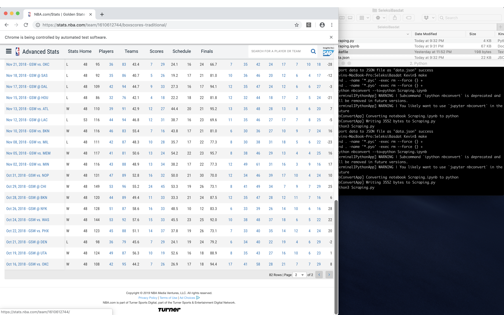
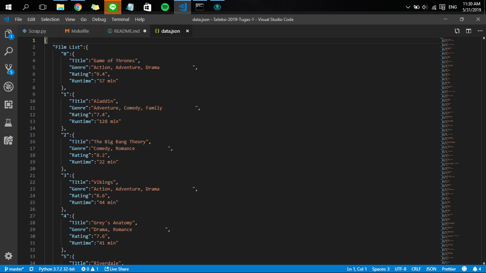

<h1 align="center">
  <br>
  1000 Top Film Based on Popularity
  <br>
  <br>
</h1>

**Naufal Aditya Dirgandhavi**
**13517064**

## Description
Sebagai seorang penikmat film, tentunya sering kebingungan untuk menentukan film apa yang bagus untuk ditonton. Untuk itu script ini ada untuk melakukan _data scraping_ mengurutkan 1000 film terbaik menurut [IMDb](https://www.imdb.com). Beberapa komponen yang akan dilakukan _data scraping_ yaitu :
- Judul Film
- Genre
- Rating
- Durasi film

## Specifications
- Runtime : Python3
- Libraries :
  - Pandas
  - BeautifulSoup
  - Requests

## How to use
Jalankan script dengan menjalankan perintah ini di CLI:
```
$ cd src
$ python3 src/Scrap.py Comedy (bisa diganti sesuai preferensi)
$ npm run start
```
File hasil *scraping* akan ditulis ke dalam direktori ```/data```.

## Ideas and Innovation
Data 1000 film terbaik ini dapat digunakan 

## JSON Structure
```
[
    {
        "Film-List": [
            "0" : {
                "Title": "Game of Thrones",
                "Genre": "Action, Adventure, Drama",
                "Rating": "9.4",
                "Runtime": "57 min"
            },
            ...
        ]
    },
]
```
## Screenshot
#Source Code

#JSON Structure(With formatter)


## References
Script ini menggunakan library dan framework:
1. BeautifulSoup sebagai tools _data scraping_ untuk bahasa pemrograman python
2. Requests untuk melakukan request pada suatu web dan mengambil data informasinya
3. Pandas untuk mengelompokan data informasi menjadi suatu _dataframe_ dan di _export_ ke dalam file json

## Author
Naufal Aditya Dirgandhavi
13517064