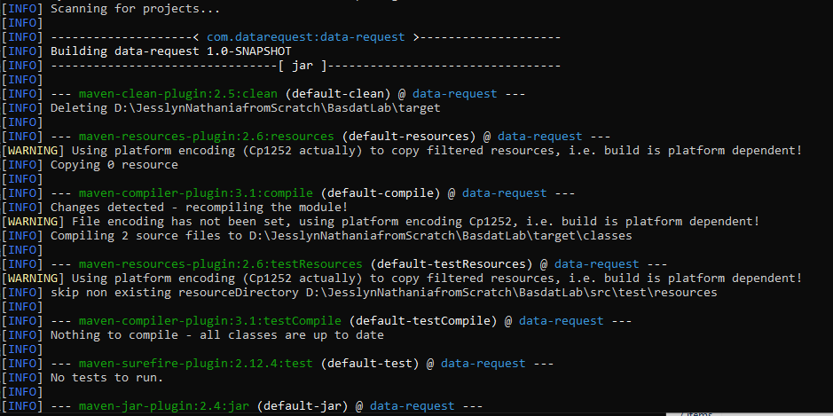
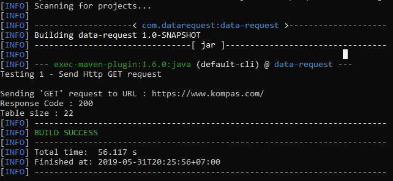
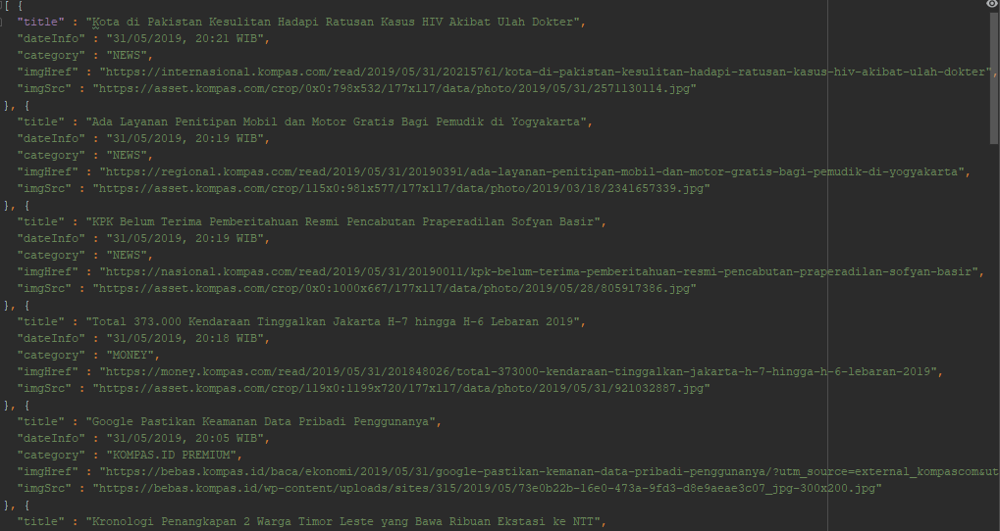

# Data Scrapping in Java 

## Description
Data scraping is done using the assist from Jsoup and Jackson. Jsoup will convert the URL given into the the document of HTML parser. The information will be stored as an object. By using Jackson, this object will then be mapped into a form of json. 

## Setup
Install [Maven](http://maven.apache.org/).

Clean your project with:

```
mvn clean
```

Build your project with:

```
mvn package
```

## Request Json file
```
mvn exec:java -DHttpRequest -Dexec.args="https://www.kompas.com/"
```

## JSON Structure
[{
<br>  "title" : string,
<br>  "dateInfo" : string,
<br>  "category" : string,
<br>  "imgHref" : string,
<br>  "imgSrc" : string
<br>}]

## Screenshots




## Reference
The libraries used :
- <a href = "https://jsoup.org/">Jsoup</a>
- <a href = "https://en.wikipedia.org/wiki/Jackson_(API)">Jackson</a>
- HttpsURLConnection

## Next Improvitation
- The current source code supported web scrapping only from https://www.kompas.com. It is expected to be able to retrieve data from any URL in the next version.
- JUnit testing will be added.  

## Author
<p align="center">
  <br>
  <b> Jesslyn Nathania - 13517053 </b>
  <br>
  <br>
</p>