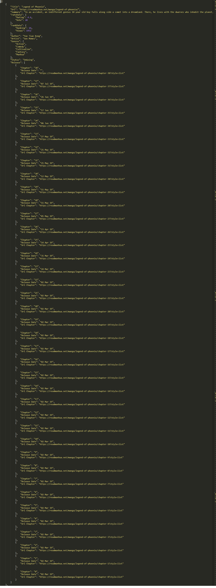

<h2 align="center">
   
  Data Scraping Nilai Ekspor Impor 2010-2018 dari Badan Pusat Statistik
   
   
</h2>

# Description
Data scraping dilakukan pada laman website <a href = "www.bps.go.id">www.bps.go.id</a> untuk mendapatkan nilai ekspor dan impor Indonesia dari tahun 2010 - 2019 setiap bulannya. Selain nilai dalam US dolar, didapatkan juga berat dalam kg yang diekspor ataupun diimpor dari Indonesia.  

# Specification
Project ini terdiri dari 3 direktori yaitu data, src dan screenshots. Pada folder src terdiri dari file scraping.ipynb dan program.py . File scraping.ipynb dibuat dalam jupyter notebook dan merupakan program untuk melakukan scraping data dari website <a href = "www.bps.go.id">www.bps.go.id</a>. Data yang diperoleh dari web disimpan dalam bentuk json pada folder data. File program.py merupakan program yang memanfaatkan hasil data scraping agar pengguna bisa mendapatkan data ekspor impor pada bulan dan tahun tertentu, membandingkan satu data dengan data lainnya serta mendapatkan jumlah nilai atau berat ekspor impor pada tahun tertentu. 

# How to use
__Linux__ :
Pastikan perangkat sudah terinstall Jupyter notebook, python3 dan library BeautifulSoup
Untuk menjalankan program data scraping:
'''
1. Dari Terminal, run jupyter notebook'
2. Pilh file scraping.ipynb
3. Pilih kernel dan pilih pilihan Restart & Run All
'''

Untuk menjalankan program program.py :
'''
1. Masuk ke direktori src
2. Pada terminal ketik python3 program.py
'''

# Ideas and innovations in utilizing the data
- Data dapat digunakan untuk mengetahui nilai ekspor impor pada bulan dan tahun tertentu
- Data dapat digunakan bagaimana apakah nilai ekspor impor mengalami kenaikan atau penurunan dalam setiap bulannya per satu tahun
- Data dapat digunakan untuk mengetahui bagaimana perubahan nilai ekspor impor dari satu tahun ke tahun lainnya

# JSON Structure
[{"Tahun": "2010", 
  "Bulan/Month": "Januari/January", 
  "Nilai/Value (US $)": "11 595 867 120,00", 
  "Berat/Weight (KG)": "43 728 031 415,00"},{}]

# Screenshot program
JSON

Hasil Tampilan Program

# Reference
Libarary yang digunakan :
- BeautifulSoup
- url.request
- time
- json

Referensi web :
- https://towardsdatascience.com/web-scraping-html-tables-with-python-c9baba21059

# Author

   
  <b> Vivianni - 13517060  </b>
   
   

