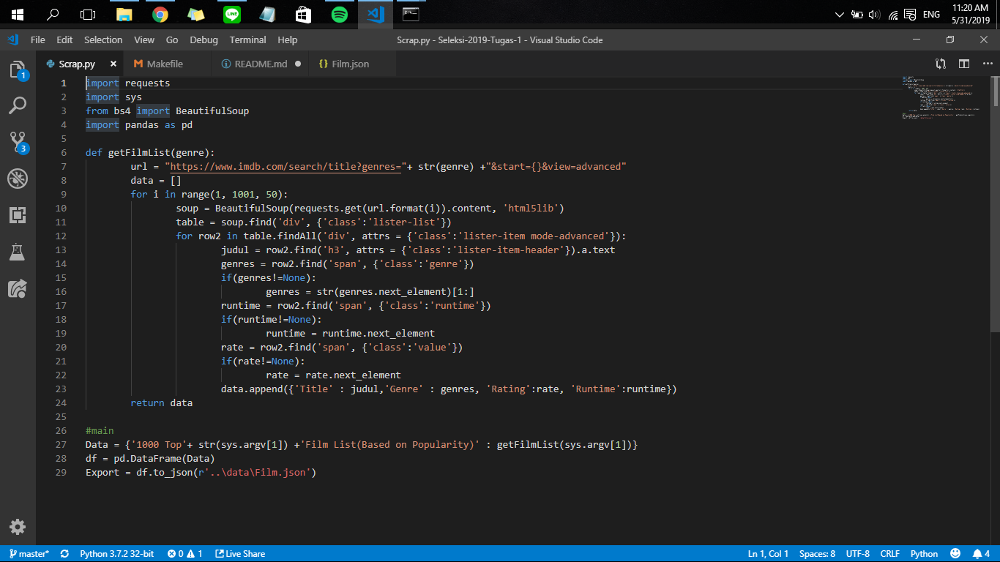

# Seleksi Tugas 1 2019 Basis Data

## Description

A data scraping project for statistics on the Golden State Warriors' games in the NBA. The data includes game location, game date, points, rebounds, win or loss, field goals, assists, steals, blocks, and so on.

## Specification

* Runtime: Python 3
* Libaries:
  * Selenium
  * ChromeDriver
  * Pandas
  * JSON

## How to use

Using Makefile,
```python
$ make
```

Using manual method, 
```python
$ python3 Scraping.py
```

## Ideas and Innovations in Utilizing the Data

This data can be used to analyze the team's performance for both a loss or a win. What was the reason for both of those, and the trends that happen during the season. 

## Screenshot



## JSON Structure

A sample data from the .json file:
```
{
  "MATCH UP":"Apr 10, 2019 - GSW @ MEM",
  "W\/L":"L",
  "MIN":48.0,
  "PTS":117.0,
  "FGM":46.0,
  "FGA":92.0,
  "FG%":50.0,
  "3PM":13.0,
  "3PA":30.0,
  "3P%":43.3,
  "FTM":12.0,
  "FTA":14.0,
  "FT%":85.7,
  "OREB":9.0,
  "DREB":30.0,
  "REB":39.0,
  "AST":32.0,
  "TOV":14.0,
  "STL":3.0,
  "BLK":5.0,
  "PF":17.0,
  "+\/-":-15.0
}
```

## References

* https://towardsdatascience.com/how-to-web-scrape-with-python-in-4-minutes-bc49186a8460
* https://stackoverflow.com/questions/39257147/convert-pandas-dataframe-to-json-format
* https://krzysztofzuraw.com/blog/2016/makefiles-in-python-projects.html
* https://github.com/TheDancerCodes/Selenium-Webscraping-Example

## Author

Full Name: Kevin Nathaniel Wijaya

Email: 13517072@std.stei.itb.ac.id
